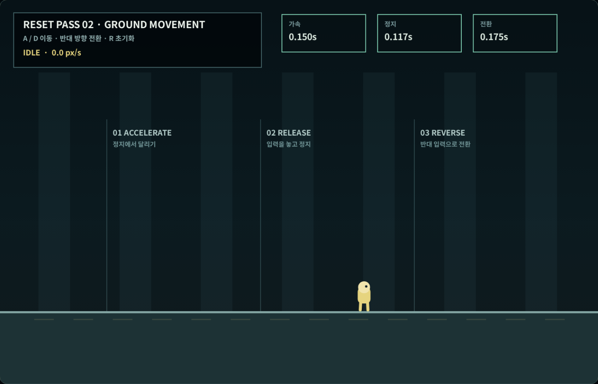

# Coreless V4 새 2차 — 지상 이동 기준선

## 이번 차수의 결과

새 40차의 2차 범위인 달리기·정지·방향 전환을 기존 V3 물리와 분리해
다시 구현했다. 점프·경사·벽·전투·카메라를 한꺼번에 조정하지 않고,
평평한 바닥에서 입력과 속도의 관계만 먼저 고정했다.

| 항목 | 확정값 | 실제 측정 |
|---|---:|---:|
| 고정 물리 간격 | 1/120초 | 1/120초 |
| 최고 지상 속도 | 400px/s | 400px/s |
| 최고속도 90% 도달 | 0.12~0.20초 | 0.150초 |
| 90% 도달 거리 | 24~36px | 27px |
| 최고속도 정지 | 0.10~0.16초 | 0.125초 |
| 최고속도 정지 거리 | 20~30px | 25px |
| 반대 방향 90% 도달 | 0.16~0.24초 | 0.192초 |
| 방향 전환 전진 밀림 | 15~24px | 19.02px |
| 한 물리 프레임 최대 이동 | 3.4px 이하 | 3.33px |

브라우저 실제 입력에서는 360px/s 상태에서 방향을 바꿨기 때문에
전환 시간 0.175초, 전진 밀림 15.42px가 기록됐다. 두 값 모두 정적
최고속도 시험보다 작고 허용 범위 안이다.

## 조작 감각 설계

### 달리기

입력을 누른 첫 프레임부터 속도가 생기지만 곧바로 최고속도로 바꾸지
않는다. 0.15초 동안 `idle → run-start → run-loop`로 넘어가므로 출발
모션을 붙일 시간이 있고, 조작은 늦게 느껴지지 않는다.

### 정지

입력을 놓으면 관성 없이 그 자리에서 고정하지도 않고, 긴 미끄러짐을
남기지도 않는다. 최고속도에서 25px 이동한 뒤 0.125초 만에 멈춘다.
좁은 발판에서 입력을 놓았는데 계속 미끄러지는 문제를 피하면서도
`run-stop` 모션을 읽을 수 있는 거리다.

### 방향 전환

반대 방향을 누르면 먼저 기존 진행 방향의 속도를 줄이고, 속도가 0을
지나는 순간 바라보는 방향을 바꾼다. 캐릭터 위치를 옆으로 옮기거나
즉시 반대 속도로 치환하지 않는다. 전환 중에는 `turn` 상태를 유지해
나중에 별도의 회전 모션을 연결할 수 있다.

### 동시 입력

왼쪽과 오른쪽을 동시에 누르면 한쪽을 임의로 우선하지 않고 중립 입력으로
처리한다. 기존 속도가 있다면 정상적인 정지 감속을 사용한다.

## 실제 키보드 검사

브라우저에서 좌표 변경 없이 다음 입력을 한 세션에서 실행했다.

1. `D`로 가속한 뒤 키를 놓아 정지
2. 다시 `D`로 90% 이상 가속
3. `D`를 놓는 즉시 `A`를 눌러 방향 전환
4. `A`를 놓아 정지
5. `→` 방향키로 같은 가속·정지 규칙 재확인

결과:

- 실제 키 입력: 누름 4회, 놓음 4회
- 가속 표본: 3회
- 정지 표본: 3회
- 방향 전환 표본: 1회
- 관측 상태: `idle`, `run-start`, `run-loop`, `run-stop`, `turn`
- 경계 충돌·강제 위치 보정: 0회
- 수동 리셋: 0회
- 콘솔 오류·페이지 오류: 0회
- 브라우저 검사: 23/23

## 이번 차수에서 하지 않은 것

- 점프와 공중 제어: 새 3차
- 경사·벽·모서리 충돌: 새 4차
- 공격·피격·회복: 새 5차
- 대형 월드 카메라: 새 6차
- 최종 캐릭터 그래픽과 모션: 새 32차

오래된 V3의 이중 점프·대시·벽 이동 수치는 이번 기준선에 포함하지
않았다. 현재 0차 계약대로 M01에는 대시나 이중 점프를 새 능력으로
넣지 않는다.

## 검사

- 결정적 지상 물리 검사: 27/27
- 런타임·문서·증거 검사 포함: 28/28
- 실제 브라우저 키 입력 검사: 23/23
- 기존 새 1차와 0차 계약: 통과
