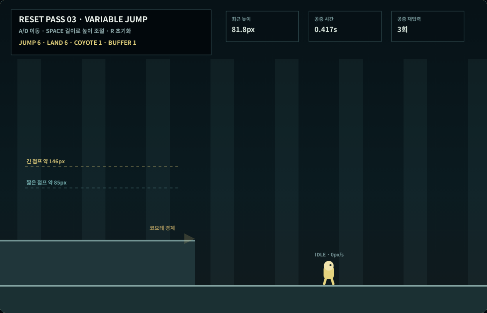

# Coreless V4 새 3차 — 가변 점프와 공중 제어

## 이번 차수의 결과

2차에서 고정한 지상 이동을 유지하면서 단일 가변 점프, 공중 방향 제어,
코요테 타임과 착지 입력 버퍼를 새 물리 계층으로 구현했다. 과거 버전의
이중 점프·대시·자동 벽 이동은 가져오지 않았다.

| 항목 | 확정값 | 결정적 측정 |
|---|---:|---:|
| 점프 시작 속도 | 820px/s | 820px/s |
| 짧은 점프 상승 | 78~98px | 85.34px |
| 긴 점프 상승 | 138~154px | 146.17px |
| 짧은 점프 공중 시간 | 0.42~0.58초 | 0.442초 |
| 긴 점프 공중 시간 | 0.65~0.82초 | 0.700초 |
| 코요테 타임 | 0.10초 | 0.067초 성공·0.133초 거부 |
| 착지 입력 버퍼 | 0.12초 | 착지 순간 1회 사용 |
| 최소 점프 유지 | 0.055초 | 버퍼 미세 점프 방지 |
| 공중 최고 수평 속도 | 380px/s | 지상 400px/s보다 낮음 |
| 낙하 최고속도 | 1,050px/s | 상한 적용 |

## 가변 점프

점프 키를 짧게 놓으면 상승 중 중력이 강해져 약 85px에서 정점에
도달한다. 정점까지 누르면 약 146px 상승한다. 버튼을 놓는 순간 속도를
0으로 바꾸지 않기 때문에 짧은 점프도 위에서 잘린 것처럼 보이지 않는다.

브라우저 실제 키 입력에서는 프레임 입력 시점 차이로 짧은 점프
78.58px, 긴 점프 139.42px가 측정됐으며 두 높이는 60.83px 차이를
유지했다.

## 코요테 타임

발판 끝에서 발이 떨어진 뒤 0.10초까지만 지상 점프를 허용한다.
결정적 검사에서는 0.067초 뒤 입력이 `coyote` 점프로 기록됐고,
0.133초 뒤 입력은 점프로 바뀌지 않았다.

코요테 점프는 캐릭터를 발판 위로 되돌리거나 위로 옮기는 보정이 아니다.
현재 공중 좌표에서 정상 점프 속도만 적용한다.

## 착지 입력 버퍼

착지 전 0.12초 안에 누른 점프는 착지 순간 한 번만 소비한다. 공중에서
입력했다고 즉시 두 번째 점프가 되지 않으며, 착지 판정이 먼저 성립해야
한다.

첫 브라우저 검사에서 점프 버튼을 착지 전에 놓으면 버퍼 점프가 약
54px의 지나치게 낮은 미세 점프가 되는 문제를 발견했다. 이를 그대로
승인하지 않고 최소 0.055초의 상승 유지를 추가했다. 수정 후 실제
버퍼 점프 높이는 81.78px로 정상적인 짧은 점프 범위에 들어왔다.

## 공중 제어

공중에서도 좌우 입력으로 이동할 수 있지만 지상 최고속도보다 낮은
380px/s로 제한한다. 반대 방향을 누르면 즉시 속도 부호를 바꾸지 않고
2,100px/s²의 공중 전환 가속도로 기존 속도를 줄인 뒤 반대 방향으로
전환한다.

결정적 검사에서는 오른쪽 275px/s에서 왼쪽 -230px/s까지 0.283초가
걸렸고, 전환 중 수평 이동은 0.38px였다. 브라우저 실제 입력에서도
250px/s에서 -225px/s로 정상 전환됐다.

## 실제 키보드 검사

좌표 변경이나 진행 건너뛰기 없이 한 브라우저 세션에서 다음 순서를
실행했다.

1. `Space`를 짧게 눌러 짧은 점프
2. `Space`를 정점까지 눌러 긴 점프
3. 낙하 초기에 다시 `Space`를 눌러 이중 점프가 되지 않는지 확인
4. 점프 중 `D → A`로 공중 방향 전환
5. `D`로 상부 발판을 벗어난 뒤 0.10초 안에 코요테 점프
6. 하부 바닥에서 착지 직전 `Space`를 눌러 버퍼 점프

결과:

- 완료된 점프 궤적: 6개
- 코요테 점프: 1회
- 착지 버퍼 점프: 1회
- 공중 점프 재입력: 3회
- 이중 점프 발생: 0회
- 관측 상태: `rise`, `apex`, `fall`, `soft-land`, `hard-land`
- 최대 수평 프레임 이동: 3.33px
- 최대 수직 프레임 이동: 8.62px
- 경계 강제 보정·수동 리셋: 0회
- 콘솔 오류·페이지 오류: 0회
- 브라우저 검사: 29/29

## 다음 차수로 넘기는 범위

- 경사와 인접 경사 변화
- 벽 측면 충돌
- 모서리 걸림과 천장 충돌
- 자동 벽타기·자동 턱 넘기 금지

위 항목은 새 4차에서 별도 충돌 시험장과 실제 키 입력으로 검증한다.

## 검사

- 결정적 공중 물리 검사: 31/31
- 런타임·문서·증거 검사 포함: 32/32
- 실제 브라우저 키 입력 검사: 29/29
- 새 2차 지상 이동 검사: 통과
