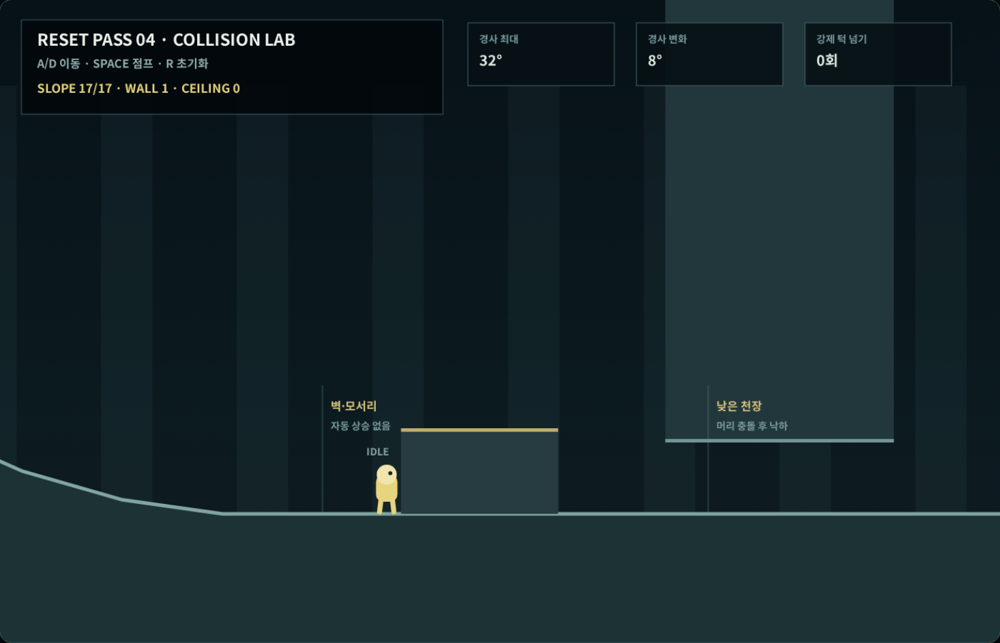
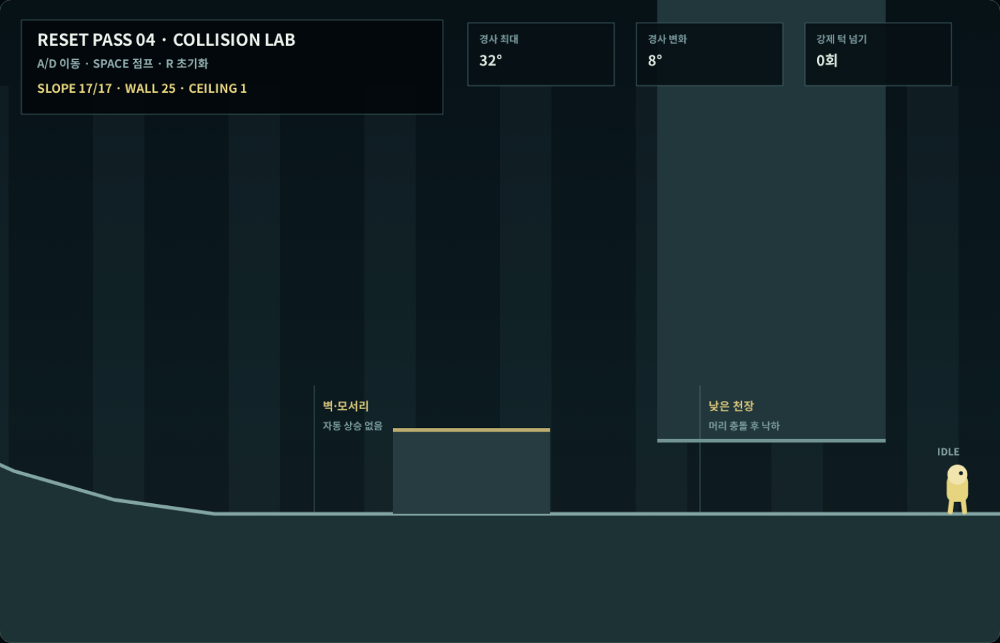

# Coreless V4 새 4차 — 경사·벽·천장 충돌

## 이번 차수의 결과

3차에서 고정한 지상 이동과 가변 점프를 유지하면서 경사, 벽 측면,
벽 윗면, 천장과 모서리 충돌을 하나의 높이장 기반 물리 계층으로
연결했다. 플레이어 좌표를 직접 옮기는 자동 벽타기나 자동 턱 넘기는
넣지 않았다.

| 항목 | 확정 기준 | 결정적 측정 |
|---|---:|---:|
| 보행 가능 최대 경사 | 32° | 32° |
| 인접 경사 변화 | 최대 8° | 8° |
| 경사 한 구간 길이 | 최소 140px | 140px |
| 경사 주행 중 공중 이탈 | 0프레임 | 0프레임 |
| 경사 수직 프레임 이동 | 2.20px 이하 | 2.083px |
| 벽 접촉 중 높이 변화 | 0px | 0px |
| 자동 턱 넘기 | 금지 | 0회 |
| 고체 내부 침투 | 금지 | 0프레임 |

## 경사와 모서리

실제 코스는 평지에서 `8° → 16° → 24° → 32°`로 올라간 뒤 같은
8° 간격으로 완만해지고, 반대 방향도 같은 순서로 내려온다. 모든
경사 구간은 최소 140px이므로 한 프레임에 지형 높이가 갑자기 바뀌지
않는다.

첫 정적 검사에서는 가장 높은 32° 경사가 바로 평지로 이어져 인접
각도가 32° 변하는 문제가 발견됐다. 이를 승인하지 않고 정상부와
하강부 양쪽에 24°·16°·8° 완화 구간을 추가했다. 수정 후 17개
지형 구간을 모두 밟는 동안 공중 이탈은 0프레임, 최대 경사 보정은
2.083px였다.

## 벽과 턱

지상에서 벽을 향해 계속 이동하면 플레이어의 오른쪽 면이 벽의 왼쪽
면인 `x=2550`에 닿는 순간 중심 좌표 `x=2510`에서 정지한다. 벽
충돌은 수평 속도만 막고 플레이어를 위로 올리지 않는다. 결정적
검사에서 벽 접촉 전후 높이 변화는 0px였다.

벽 위로 올라가는 유일한 방법은 실제 `Space + D` 점프다. 벽을
밀기만 해서 위로 솟구치거나 모서리를 자동으로 넘는 경우는 0회였다.
벽점프와 벽타기는 아직 해금되지 않은 능력이므로 이번 차수에도
포함하지 않았다.

## 낮은 천장

낮은 천장은 화면 위쪽 구조물과 이어져 있어 떠 있는 장식처럼 보이지
않는다. 천장 아래에서 점프하면 플레이어 머리가 정확히 `y=620`에서
멈추고 상승 속도가 제거된 뒤 자연스럽게 낙하한다. 충돌 뒤 고체
내부에 남아 있던 프레임은 0이다.

## 실제 키보드 검사

좌표 변경이나 진행 건너뛰기 없이 한 브라우저 세션에서 다음 순서를
실행했다.

1. `D`를 유지해 17개 경사 구간을 처음부터 끝까지 통과
2. 계속 `D`를 눌러 지상 벽 충돌과 자동 상승 금지를 확인
3. `Space + D`로 직접 점프해 벽 윗면에 착지
4. `D`로 벽에서 내려와 낮은 천장 아래로 이동
5. `Space`로 천장에 머리 충돌
6. `D`로 시험장 출구까지 이동

결과:

- 방문한 경사 구간: 17/17
- 경사 주행 중 공중 이탈: 0프레임
- 지상 벽 충돌: 1회 이상
- 실제 점프로 벽 윗면 착지: 성공
- 천장 충돌: 1회
- 의도한 점프: 2회
- 자동 턱 넘기: 0회
- 고체 내부 침투: 0프레임
- 최대 수평 프레임 이동: 3.33px
- 최대 수직 프레임 이동: 6.75px
- 최대 합성 프레임 이동: 7.53px
- 경계 강제 보정·수동 리셋: 0회
- 콘솔 오류·페이지 오류: 0회
- 브라우저 검사: 26/26

## 다음 차수로 넘기는 범위

- 기본 공격의 선딜·활성·후딜
- 공격 입력과 캐릭터 이동의 공존
- 피격 경직과 짧은 무적 시간
- 실제 적을 넣기 전 공격 판정 가시화

위 항목은 새 5차에서 별도 전투 시험장과 실제 키 입력으로 검증한다.
몬스터 종류와 방별 전투 임무는 공격·피격 기초가 고정된 뒤 배치한다.

## 검사

- 결정적 충돌 물리 검사: 26/26
- 런타임·문서·증거 검사 포함: 27/27
- 실제 브라우저 키 입력 검사: 26/26
- 새 2차 지상 이동·새 3차 공중 이동 계약: 통과
