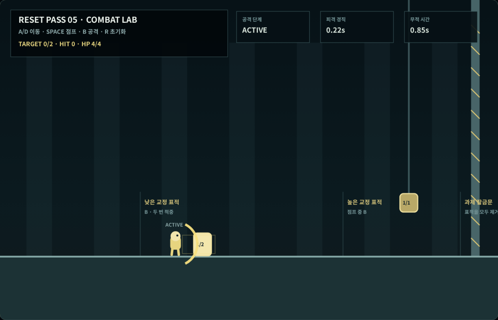
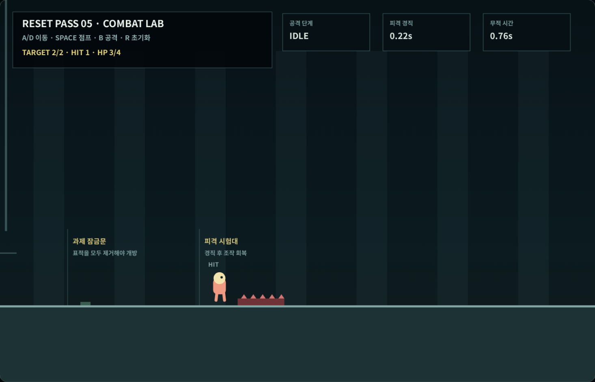
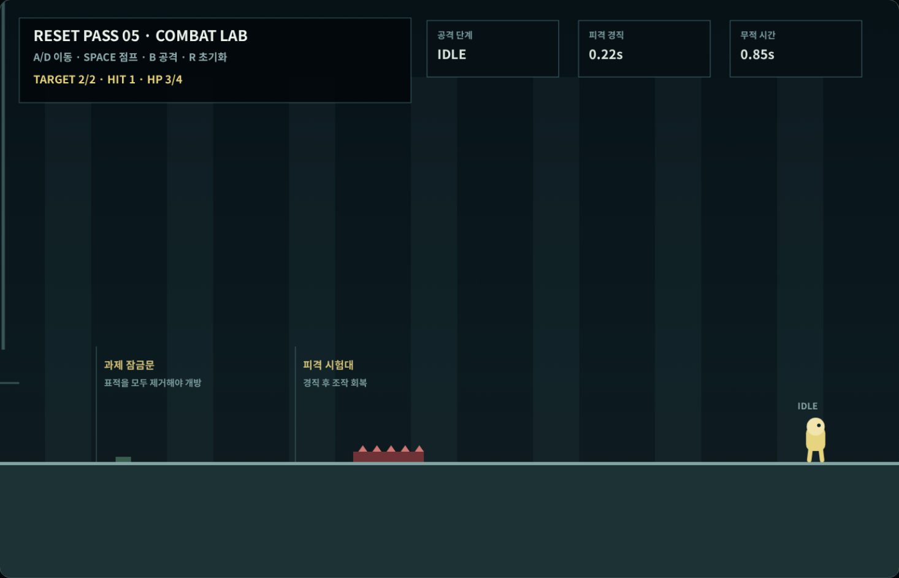

# Coreless V4 새 5차 — 기본 공격·피격·회복

## 이번 차수의 결과

4차까지 고정한 이동·점프·충돌을 유지하면서 시작부터 보유한 기본
공격과 플레이어 피격 규칙을 구현했다. 실제 적 AI를 성급하게 넣지
않고, 반격하지 않는 낮은·높은 교정 표적과 한 개의 피격 시험대로
공격 판정과 회복을 분리해 검증했다.

| 항목 | 확정값 | 실제 브라우저 측정 |
|---|---:|---:|
| 공격 선딜 | 0.07초 | 단계 관측 |
| 공격 활성 판정 | 0.09초 | 단계 관측 |
| 공격 후딜 | 0.18초 | 단계 관측 |
| 총 공격 시간 | 0.34초 | 4회 시작 |
| 공격 중 최고 이동 속도 | 평상시의 82% | 328px/s |
| 공격 입력 버퍼 | 후딜 마지막 0.12초 | 1회 대기·1회 실행 |
| 피격 경직 | 0.22초 | 회복 확인 |
| 피격 무적 | 0.85초 | 중복 피해 5프레임 차단 |
| 최대 체력 | 4 | 최종 3/4 |

## 공격의 세 단계

기본 공격은 `B`를 누르면 선딜, 활성 판정, 후딜 순서로 진행한다.
금색 궤적이 가장 선명한 활성 단계에서만 판정 사각형이 생긴다.
한 번의 공격 번호는 같은 표적을 한 번만 타격하므로, 판정이 표적과
여러 프레임 겹쳐도 체력이 반복해서 줄지 않는다.

낮은 교정 표적은 체력 2로 설정해 서로 다른 공격 두 번을 요구했고,
높은 표적은 점프 중 공격해야 닿는 위치에 배치했다. 높은 표적은
천장 레일에 연결해 공중에 이유 없이 떠 있는 바닥이나 장식처럼
보이지 않게 했다.

## 이동과 입력 버퍼

공격 중에도 이동은 멈추지 않으며 최고속도 400px/s의 82%인
328px/s까지 유지한다. 따라서 공격 버튼을 누를 때마다 캐릭터가
제자리에 붙잡히지 않는다.

후딜 마지막 0.12초에 새 공격을 누르면 입력 한 개만 보관했다가
현재 공격이 끝나는 즉시 다음 선딜을 시작한다. 버튼을 계속 누르고
있거나 여러 번 난타해 공격이 무한히 쌓이는 기능은 허용하지 않았다.

## 취소 규칙

- 선딜 중 점프: 공격을 취소하고 즉시 점프
- 활성 판정 0.09초 중 점프: 공격 판정을 유지하고 점프는 시작하지 않음
- 후딜 중 점프: 남은 후딜을 취소하고 즉시 점프
- 좌우 이동: 공격을 취소하지 않음
- 피격: 어떤 공격 단계든 즉시 취소

선딜을 점프로 취소하면 보이지 않는 공격 판정이 나중에 발생하지
않는다. 반대로 실제 판정이 이미 나온 0.09초만 유지해 공격 시점과
결과가 서로 어긋나지 않게 했다.

## 피격·넉백·무적

오른쪽의 위험판에 닿으면 체력이 한 칸 줄고, 위험원 반대쪽과 위쪽으로
넉백된다. 조작 불가능 시간은 0.22초이며, 무적 시간은 0.85초다.
조작이 무적보다 먼저 돌아오기 때문에 플레이어는 회복 직후 스스로
위험 구간을 빠져나갈 수 있다.

실제 브라우저 검사에서는 공격 활성 중 위험판에 닿아 공격이 취소됐다.
이후 무적이 남아 있는 상태에서 위험판에 다시 5프레임 접촉했지만
체력은 `3/4`에서 더 줄지 않았다.

## 과제 잠금

낮은 표적과 높은 표적을 모두 제거하기 전에는 천장부터 바닥까지
연결된 잠금문이 진행을 막는다. 두 표적이 파괴되는 순간에만 문이
열린다. 이는 앞으로 몬스터나 필수 과제가 있는 공간을 임무 완료
전에 빠져나갈 수 없게 만드는 공통 규칙의 첫 구현이다.

## 실제 키보드 검사

좌표 변경이나 진행 건너뛰기 없이 한 브라우저 세션에서 다음 순서를
실행했다.

1. `D`로 낮은 교정 표적 앞까지 이동
2. `B` 첫 공격과 후딜 버퍼의 두 번째 `B` 공격으로 표적 제거
3. `D + Space` 점프 중 `B`로 높은 표적 제거
4. 두 표적 완료 후 잠금문 개방 확인
5. `B + D` 공격 중 피격 시험대에 접촉해 공격 취소와 넉백 확인
6. 무적 중 `D`로 다시 접촉해 중복 피해 차단 확인
7. `Space + D`로 위험판을 넘어 출구 도달

결과:

- 공격 시작·활성: 4/4
- 완전히 끝난 공격: 3회
- 피격으로 중단된 공격: 1회
- 표적 타격: 3회
- 표적 파괴: 2/2
- 후딜 입력 버퍼: 대기 1회·실행 1회
- 받은 피해: 1회
- 무적 중 차단된 접촉 피해: 5프레임
- 최종 체력: 3/4
- 최대 공격 중 속도: 328px/s
- 최대 수평 프레임 이동: 3.33px
- 최대 수직 프레임 이동: 6.89px
- 최대 합성 프레임 이동: 7.59px
- 경계 강제 보정·수동 리셋: 0회
- 콘솔 오류·페이지 오류: 0회
- 브라우저 검사: 29/29

## 검사 중 수정한 문제

첫 결정적 검사는 공격이 끝난 뒤 정상 최고속도로 복귀한 프레임까지
공격 중 속도에 포함해 1개 항목이 실패했다. 측정 범위를 실제 공격
상태 프레임으로 바로잡은 뒤 328px/s 제한을 확인했다.

첫 브라우저 실행에서는 넉백이 플레이어를 위험판 밖으로 밀어내
무적 중 재접촉 조건이 생기지 않았다. 회복 직후 실제 `D` 입력으로
위험판을 다시 밟아 체력이 줄지 않는 경로로 보완했다. 다음 실행은
플레이를 완주했지만 검사기가 정적 감사와 런타임 감사를 혼동해 결과
정리 단계에서 중단됐다. 읽기 위치를 런타임 스냅샷으로 통일한 뒤
최종 실행을 통과했다.

## 다음 차수로 넘기는 범위

- 대형 월드용 수평·수직 카메라
- 진행 방향 선행 시야
- 급격한 카메라 따라잡기와 화면 순간 이동 방지
- 피격 시 카메라가 넉백을 과장하지 않는 규칙

위 항목은 새 6차에서 별도 대형 월드 카메라 시험장과 실제 입력으로
검증한다. 적의 발견·공격 예고·회복 AI는 16차에서 다룬다.

## 검사

- 결정적 전투 물리 검사: 24/24
- 런타임·문서·증거 검사 포함: 25/25
- 실제 브라우저 키 입력 검사: 29/29
- 새 2~4차 이동·점프·충돌 계약: 통과
