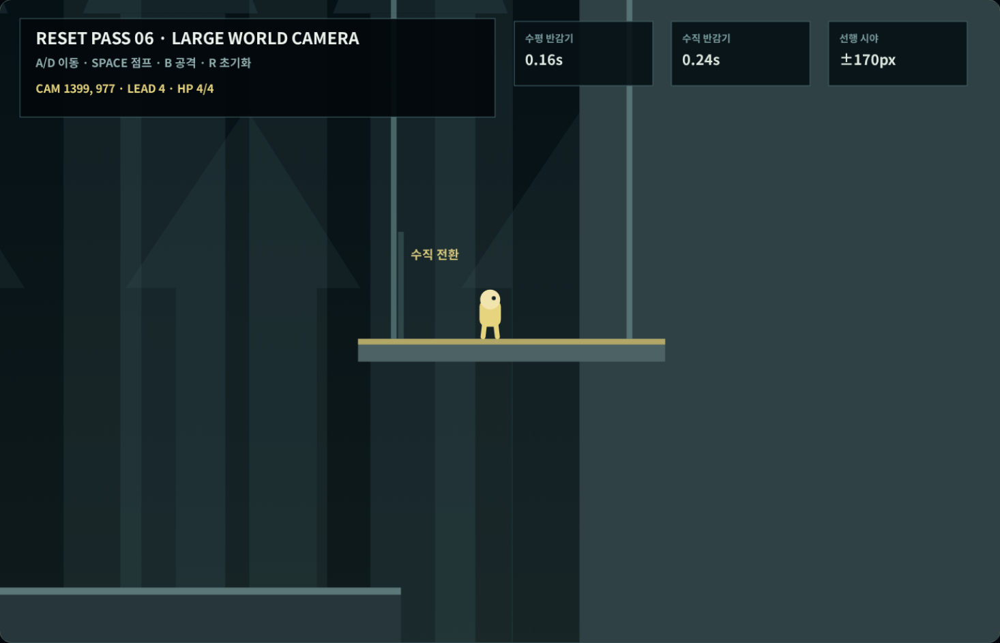
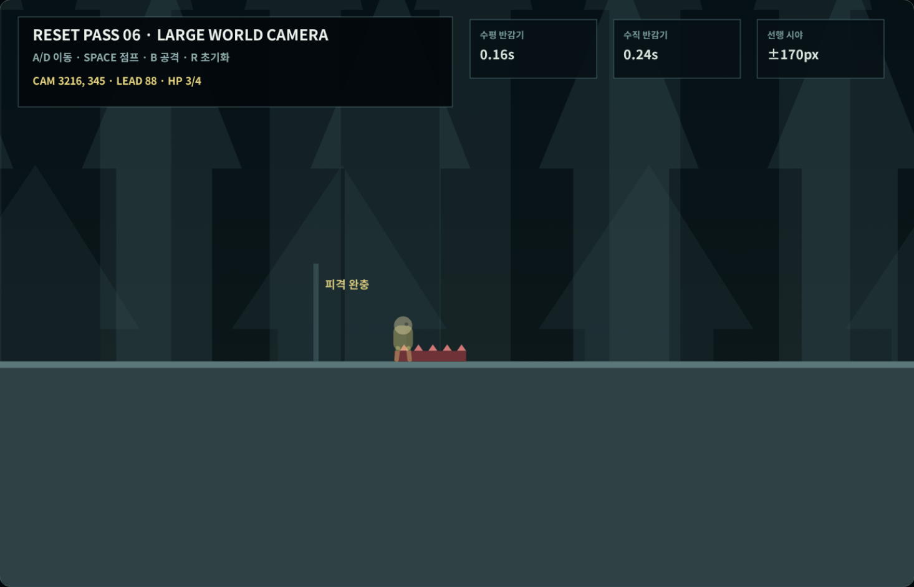
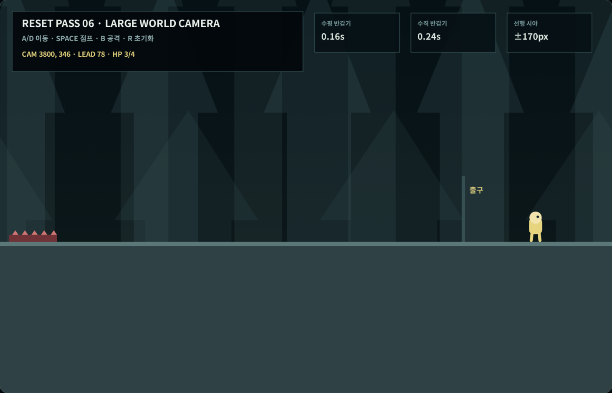

# Coreless V4 새 6차 — 대형 월드 카메라

## 이번 차수의 결과

5차까지 고정한 이동·점프·충돌·공격·피격 규칙을 유지하면서,
초대형 월드의 수평·수직 카메라와 진행 방향 선행 시야를 구현했다.
이번 시험장은 최종 방 프레이밍을 만드는 7차가 아니라, 넓은 수평
통로와 900px 승강 전환에서도 카메라 자체가 순간 이동하지 않는지
검증하는 독립 단계다.

| 항목 | 확정값 | 실제 브라우저 측정 |
|---|---:|---:|
| 수평 추적 반감기 | 0.16초 | 최대 5.47px/고정 프레임 |
| 수직 추적 반감기 | 0.24초 | 최대 2.03px/고정 프레임 |
| 진행 방향 선행 시야 | ±170px | +170px / -164px |
| 원경 시차 | 16% | 실제 카메라보다 느리게 이동 |
| 중경 시차 | 38% | 실제 카메라보다 느리게 이동 |
| 근경 시차 | 68% | 실제 지형보다 느리게 이동 |
| 피격 화면 반응 | 최대 5px·0.14초 | 최대 4.85px |
| 피격 순간 카메라 이동 | 12px 미만 | 2.95px |

## 수평·수직 추적

수평 이동은 플레이어의 빠른 방향 전환과 달리기를 읽기 위해
0.16초 반감기로 따라간다. 수직 이동은 점프 정점과 낙하 때 화면이
불필요하게 출렁이지 않도록 0.24초로 더 느리게 따라간다.

실제 키 입력 경로에는 하층 수평 통로와 900px 높이의 승강기를
배치했다. 승강기는 플레이어가 실제로 위에 올라갔을 때만 작동하며
플레이어 좌표나 카메라 좌표를 검사기에서 주입하지 않는다. 세 번의
반복 실행에서 수직 카메라는 956px 이상 이동했고 최대 프레임 이동은
약 2.03px였다.

## 진행 방향 선행 시야

달리기 속도가 80px/s를 넘으면 이동 방향으로 최대 170px를 먼저
보여 준다. 선행 시야 자체도 0.20초 반감기로 보간하므로 오른쪽에서
왼쪽으로 방향을 바꿀 때 화면 중심이 즉시 반대편으로 튀지 않는다.

실제 `D→A→D` 입력에서 선행 시야는 +170px에서 -164px까지
양방향으로 관측됐다. 피격 경직 중에는 넉백 속도를 진행 의도로
간주하지 않고 선행 시야 목표를 0으로 돌린다.

## 피격 완충

상층 통로의 위험판은 5차 피격·무적 규칙을 그대로 사용한다.
체력은 `4→3`으로 한 번만 줄었고 무적 중 재접촉 56프레임은 모두
무시됐다. 이번 교정판은 첫 피격 뒤 다시 피해를 주지 않아 카메라
경로를 반복 측정하는 목적과 실제 전투 난도를 섞지 않는다.

피격 화면 반응은 최대 5px, 0.14초로 제한했다. 카메라 세계 좌표와
화면 반응을 분리했기 때문에 충돌 위치나 플레이어 위치가 흔들림에
따라 바뀌지 않는다.

## 3단 깊이

원경·중경·근경은 카메라 이동량의 16%·38%·68%만큼 이동한다.
세 레이어 모두 실제 충돌 지형보다 느리며, 플레이어가 밟을 수 있는
바닥과 혼동되지 않는 낮은 명도로 그렸다. 현재 형태는 패럴랙스의
수치와 방향을 확인하기 위한 회색박스이며 최종 환경 아트가 아니다.

## 검사 중 수정한 문제

첫 브라우저 실행에서는 두 가지 검사 문제가 발견됐다.

1. 실제 선행 시야는 양방향으로 전환됐지만 방향 전환 집계가
   속도 0 통과 프레임만 찾고 있어 전환을 기록하지 못했다. 실제
   반대 방향 입력과 이전 속도를 대조하도록 집계 기준을 수정했다.
2. 위험판 위를 무적 상태로 다시 지난 뒤 무적이 끝나면 두 번째
   피해가 발생했다. 카메라 교정판은 첫 피격과 무적 접촉만
   측정하도록 바꾸고, 이후 재피격은 막았다.

수정 후 실제 키 입력 검사는 세 번 연속 `31/31`을 통과했다.

## 다음 7차

7차에서는 카메라 수치를 다시 바꾸지 않고 실제 공간 경계에
연결한다. 천장 노출률 6~12%, 공간별 카메라 경계, 화면 아래로
이어지는 지지대, 최대 활성 공간 수와 스트리밍을 검증한다.
